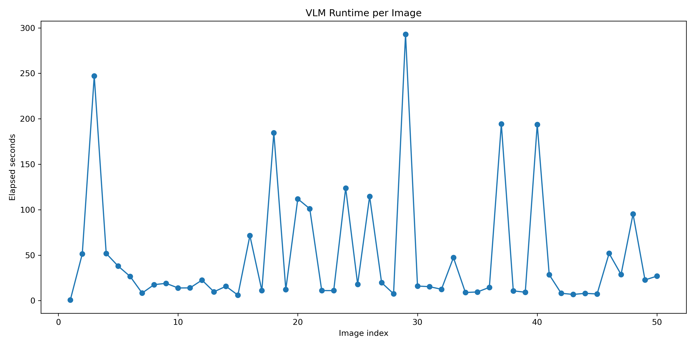

# Fridge-to-Recipe Assistant

This project builds a Vision-Language Model (VLM) focused fridge-to-recipe assistant for the Applied Artificial Intelligence Lab.

The goal is to identify visible ingredients from fridge images using a VLM and use the extracted ingredients as the basis for recipe recommendation.

The current project stage focuses on open-vocabulary ingredient extraction, normalization, and quantitative evaluation on manually reviewed fridge images.

---

## Project Idea

The assistant takes a fridge image as input, extracts visible ingredients using a Vision-Language Model, uses the final ingredient list for recipe recommendation.

The pipeline is:

```text
Fridge image → VLM-based ingredient extraction → ingredient normalization → recipe retrieval/generation → recipe ranking → recipe recommendation
````

## Dataset

This project uses the Roboflow `fridge-detection-merged` dataset.

The raw dataset is stored locally under:

```text
data/raw/
```
The dataset contains fridge images with cluttered shelves, occluded objects, packaging, and partially visible food items. The original YOLO-style labels cover only a limited set of ingredient classes, so they are treated as partial reference information only.

The main evaluation uses manually reviewed open-vocabulary image-level ground truth labels.

### Dataset Example


Dataset statistics, split sizes, class names, and class distribution are documented in:

```text
reports/dataset_audit_report.md
```

Visual dataset inspection notes are documented in:

```text
reports/dataset_visual_inspection.md
```

---

## Repository Structure

```text
fridge-to-recipe-assistant/
├── README.md
├── ai_tool_usage.md
├── app_vlm_review.py
├── configs/
│   ├── ingredient_normalization.json
│   ├── vlm_prompt.txt
│   └── vlm_prompt_with_counts.txt
├── data/
│   └── raw/                         # local only, not committed
├── reports/
│   ├── dataset_audit_report.md
│   ├── dataset_visual_inspection.md
│   ├── figures/
│   │   ├── sample_grid_train.png
│   │   ├── sample_grid_valid.png
│   │   └── sample_grid_test.png
│   ├── manual_ground_truth_100.csv
│   ├── vlm_predictions_100.jsonl
│   ├── evaluation_100/
│   │   ├── vlm_per_image_evaluation.csv
│   │   ├── vlm_false_positives.csv
│   │   ├── vlm_false_negatives.csv
│   │   ├── vlm_evaluation_summary.md
│   │   ├── vlm_bootstrap_metrics.csv
│   │   ├── vlm_bootstrap_summary.md
│   │   └── figures/
│   │       ├── precision_vs_recall_100.png
│   │       ├── top_false_positives_100.png
│   │       └── top_false_negatives_100.png
│   ├── evaluation_50/
│   │   ├── inputs/
│   │   ├── vlm_per_image_evaluation.csv
│   │   ├── vlm_false_positives.csv
│   │   ├── vlm_false_negatives.csv
│   │   ├── vlm_evaluation_summary.md
│   │   ├── vlm_bootstrap_metrics.csv
│   │   ├── vlm_bootstrap_summary.md
│   │   └── figures/
│   └── preliminary_vlm_trial/
│       ├── analyze_trial_vlm_outputs.py
│       ├── app_trial_review.py
│       ├── vlm_predictions_raw.jsonl
│       ├── vlm_predictions_flat.csv
│       ├── vlm_ingredient_frequencies.csv
│       ├── vlm_uncertain_frequencies.csv
│       ├── vlm_item_frequencies_combined.csv
│       ├── vlm_output_analysis.md
│       └── figures/
└── src/
    ├── data/
    │   ├── dataset_audit.py
    │   ├── create_sample_grid.py
    │   └── create_vlm_eval_subset.py
    ├── evaluation/
    │   ├── evaluate_vlm_predictions.py
    │   ├── bootstrap_evaluation_metrics.py
    │   └── visualize_vlm_error_analysis.py
    └── vlm/
        ├── test_innkube_vlm.py
        ├── run_vlm_baseline.py
        ├── run_vlm_counts_trial.py
        └── vlm_jsonl_to_csv.py
```
reports/evaluation_50/ contains archived outputs from the earlier 50-image evaluation. The final reported results are stored under reports/evaluation_100/
---

## VLM-Based Ingredient Extraction

The project uses a VLM-first approach for ingredient extraction.

The VLM receives a fridge image and returns structured ingredient predictions. The final structured prompt asks the model to return:

* ingredient name
* quantity
* unit
* confidence
* visual evidence
* uncertain items

The structured prompt is stored in:

```text
configs/vlm_prompt_with_counts.txt
```

The VLM output is saved in JSONL format:

```text
reports/vlm_predictions_100.jsonl
```

---

## Manual Ground Truth

The final evaluation uses a manually reviewed 100-image ground truth file:

```text
reports/manual_ground_truth_100.csv
```

Each image is annotated at image level with visible ingredients.

The manual review process follows these rules:

* Include ingredients that are clearly visible.
* Include packaged items only when the label or contents are visually identifiable.
* Do not add guessed or unverifiable items.
* Do not blindly accept VLM predictions.
* If a VLM prediction is clearly visible in the image but missed in the first annotation, add it to the reviewed ground truth.
* If a VLM prediction is plausible but not visually confirmable, keep it as a false positive.

This keeps the evaluation fair while reducing incompleteness in the manual ground truth.

---

## Ingredient Normalization

Because the task is open-vocabulary, the same ingredient can appear under different names.

Examples:

```text
eggs → egg
green bell pepper → bell pepper
```

Normalization rules are stored in:

```text
configs/ingredient_normalization.json
```

The same normalization is applied to both:

```text
manual ground truth labels
VLM prediction labels
```

Generic or uncertain labels are excluded from the main ingredient-level evaluation, for example:

```text
unknown bottle
prepared food
container
package
```

This prevents vague predictions from being counted as specific ingredient detections.

---

## Evaluation

The final evaluation was performed on 100 manually reviewed fridge images.

Since this is an open-vocabulary multi-label ingredient extraction task, standard classification accuracy is not the main metric. Precision, recall, and F1-score are used as the primary metrics. Exact match accuracy and mean Jaccard similarity are reported as additional image-level metrics.

The final normalized evaluation results are:

| Metric                  |  Value |
| ----------------------- | -----: |
| True Positives          |    477 |
| False Positives         |    519 |
| False Negatives         |    309 |
| Micro Precision         | 0.4789 |
| Micro Recall            | 0.6069 |
| Micro F1-score          | 0.5354 |
| Macro Precision         | 0.5007 |
| Macro Recall            | 0.6324 |
| Macro F1-score          | 0.5357 |
| Exact Match Accuracy    | 0.0200 |
| Mean Jaccard Similarity | 0.3910 |

The VLM achieved higher recall than precision. This means that it detected a reasonable portion of visible ingredients, but it also produced many additional predictions that were not confirmed in the reviewed ground truth.

---

## Precision vs Recall


This plot shows one point per image. It helps identify whether the VLM is mostly over-predicting or missing ingredients.

Images with high recall but low precision indicate that the model found several correct ingredients but also added many extra predictions.

## Top False Positives


This plot shows the most frequent extra VLM predictions that were not present in the reviewed ground truth.

These false positives often come from:

* plausible but unverifiable guesses
* ambiguous packaging
* partially visible containers
* unreadable product labels
* context-based assumptions about common fridge items

## Top False Negatives


This plot shows the most frequent ground-truth ingredients missed by the VLM.

These false negatives often occur when ingredients are:

* small
* occluded
* in the background
* inside transparent or unclear packaging
* visually similar to other items
* not easily readable from the image

---

## Bootstrap Confidence Intervals

Image-level bootstrap resampling was used to estimate uncertainty in the final 100-image evaluation.

In each bootstrap iteration, 100 images were sampled with replacement from the evaluated subset, and the metrics were recalculated. This was repeated for 10,000 bootstrap iterations. The 2.5th and 97.5th percentiles of the bootstrap distributions were used as 95% confidence intervals.

| Metric                  | Original Value | Bootstrap Mean | 95% CI Lower | 95% CI Upper |
| ----------------------- | -------------: | -------------: | -----------: | -----------: |
| Micro Precision         |         0.4789 |         0.4789 |       0.4379 |       0.5204 |
| Micro Recall            |         0.6069 |         0.6072 |       0.5666 |       0.6475 |
| Micro F1-score          |         0.5354 |         0.5352 |       0.5000 |       0.5703 |
| Macro Precision         |         0.5007 |         0.5003 |       0.4566 |       0.5444 |
| Macro Recall            |         0.6324 |         0.6327 |       0.5878 |       0.6763 |
| Macro F1-score          |         0.5357 |         0.5356 |       0.4961 |       0.5738 |
| Mean Jaccard Similarity |         0.3910 |         0.3908 |       0.3537 |       0.4284 |
| Exact Match Accuracy    |         0.0200 |         0.0200 |       0.0000 |       0.0500 |

The bootstrap means are very close to the original metric values, which suggests that the reported scores are stable for the selected 100-image evaluation subset.

The micro-F1 score remains within approximately 0.50 to 0.57 under bootstrap resampling. The recall confidence interval is higher than the precision confidence interval, supporting the observation that the VLM is more recall-oriented than precision-oriented.

---

## VLM Inference Latency

The VLM was queried image-by-image through the InnKube endpoint.

Runtime for each image is stored in:

The runtime values are important because this project is not only about ingredient extraction quality, but also about practical usability. Large VLM inference through an external endpoint is suitable for offline or prototype-level evaluation, but latency can become a limitation for real-time recipe recommendation.

Runtime varied across images, which shows the practical cost of using a large VLM for fridge image analysis.



These earlier plots show that VLM inference time varies across images and should be considered when designing the final application.

---

## Preliminary VLM Trial

Earlier exploratory VLM outputs and visualizations are stored under:

```text
reports/preliminary_vlm_trial/
```

These files document the first open-vocabulary VLM run before final manual ground truth review, ingredient normalization, and 100-image evaluation.

This archived folder includes:

```text
reports/preliminary_vlm_trial/vlm_predictions_raw.jsonl
reports/preliminary_vlm_trial/vlm_predictions_flat.csv
reports/preliminary_vlm_trial/vlm_ingredient_frequencies.csv
reports/preliminary_vlm_trial/vlm_uncertain_frequencies.csv
reports/preliminary_vlm_trial/vlm_item_frequencies_combined.csv
reports/preliminary_vlm_trial/vlm_output_analysis.md
reports/preliminary_vlm_trial/figures/
```

The preliminary analysis script is archived in the same folder:

```text
reports/preliminary_vlm_trial/analyze_trial_vlm_outputs.py
```

---

## Structured VLM Review UI

A Streamlit UI is available for reviewing structured VLM outputs image by image:

```bash
streamlit run app_vlm_review.py
```
This UI was used to inspect VLM predictions and support manual ground truth review.

---

## Interpretation of Final Results

The final 100-image evaluation shows that the VLM is useful for broad open-vocabulary ingredient discovery in fridge images.

The model achieved:

```text
Micro Precision: 0.4789
Micro Recall:    0.6069
Micro F1-score:  0.5354
```

The higher recall than precision indicates that the model detects many relevant ingredients, but frequently over-predicts plausible items that are not visually confirmed.

This behavior is expected in cluttered fridge scenes because the model may rely on context, packaging cues, or common food associations. For example, a partially visible bottle or container may lead to a plausible but unverifiable prediction.

Exact match accuracy is low because it requires the complete predicted ingredient set to exactly match the ground truth set for an image. This is very strict for open-vocabulary multi-label ingredient extraction. Mean Jaccard similarity is more informative because it measures partial overlap between predicted and ground-truth ingredient sets.

---

## Limitations

Current limitations:

* Some ingredients are difficult to verify due to occlusion, clutter, transparent packaging, or unreadable labels.
* VLM outputs may include plausible but unverifiable guesses.
* The model sometimes predicts broad or generic food categories.
* Inference time is high because a large VLM is queried through an external endpoint.

---

## Next Steps

1. Perform deeper qualitative error analysis on the most frequent false positives and false negatives.
2. Add confidence filtering or stricter post-processing to reduce over-prediction.
3. Build the recipe recommendation module using normalized extracted ingredients.
4. Explore runtime reduction strategies for practical deployment.

