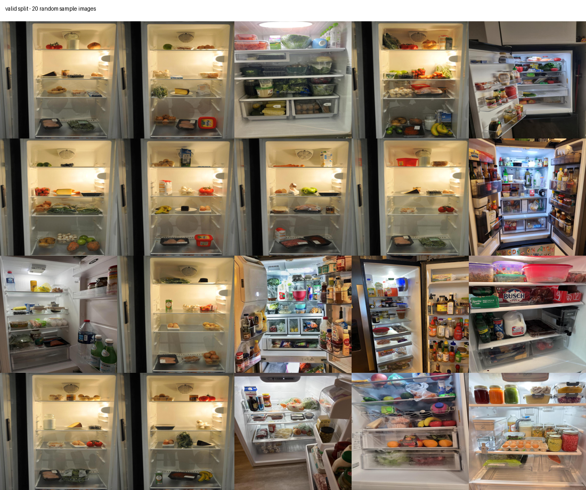
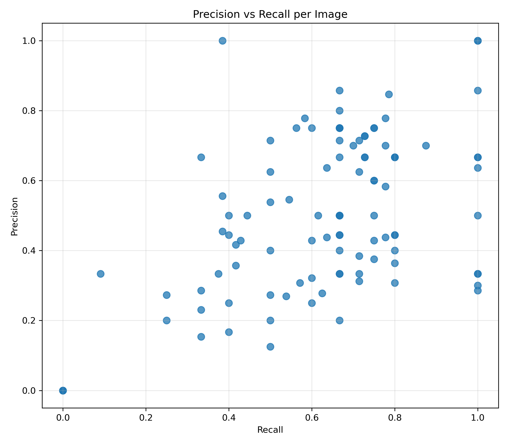
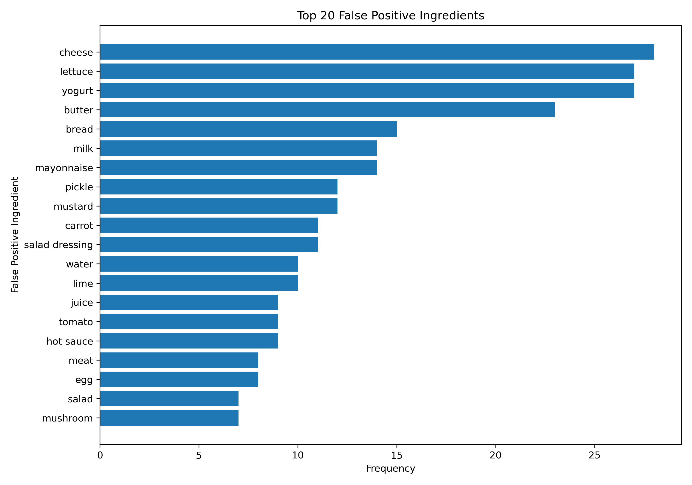
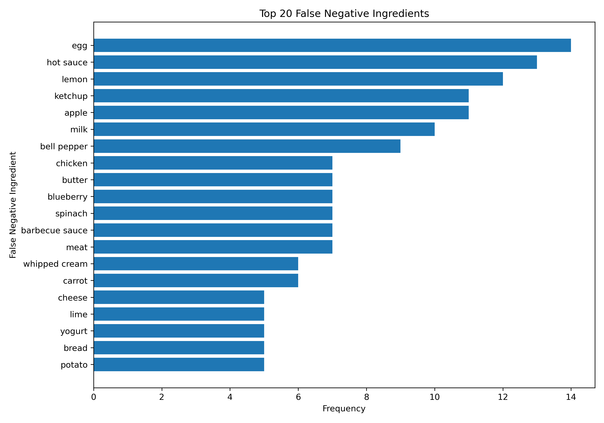
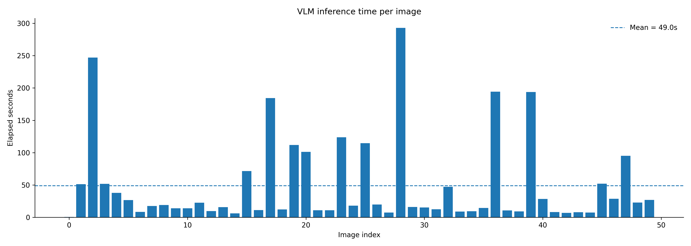
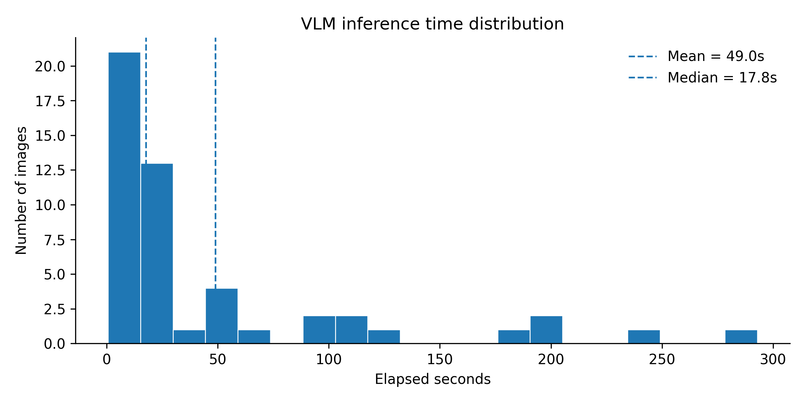

# Fridge-to-Recipe Assistant

A fridge-to-recipe assistant built for the Applied Artificial Intelligence Lab.

The system uses Vision-Language Model (VLM) predictions to identify visible ingredients in fridge images and recommend recipes based on those ingredients. The project combines ingredient extraction, normalization, confidence filtering, recipe retrieval, recipe ranking, model comparison, and a React + FastAPI demo interface.

---

## Project Overview

The main idea is to connect fridge image understanding with recipe recommendation.

```text
Fridge image
→ VLM ingredient extraction
→ ingredient normalization
→ confidence filtering
→ recipe retrieval
→ recipe ranking
→ grocery suggestion
→ user interface
```

The current app uses saved VLM predictions from the evaluated dataset and connects them to a recipe recommendation pipeline.

---

## Current Status

The core pipeline has been implemented and experimentally validated.

| Component | Status |
|---|---|
| VLM ingredient extraction | Implemented |
| Manual ground truth review | Implemented for 100 images |
| Ingredient normalization | Implemented |
| Quantitative evaluation | Implemented |
| Error analysis | Implemented |
| Confidence filtering | Implemented |
| Gemma vs Qwen comparison | Implemented |
| Recipe retrieval | Implemented as prototype |
| Hybrid recipe ranking | Implemented |
| React + FastAPI UI | Implemented |
| Local grocery guidance | Implemented |
| Large-scale recipe search / Elasticsearch | Future scalable extension |
| Real-time user image upload | Future extension |
| Online deployment | Future extension |

---

## Demo Application

The current user-facing demo is built with:

```text
Frontend: React + Vite
Backend: FastAPI
Recipe retrieval: local hybrid retrieval over RecipeNLG Lite recipes
```

The UI allows the user to:

1. Select a fridge image.
2. View detected visible ingredients.
3. Choose recipe preferences.
4. Get recipe recommendations.
5. View matched and missing ingredients.
6. Select a nearby shopping area and shop for missing items.

---

## Running the App

### 1. Start the backend

From the project root:

```bash
uvicorn backend.api:app --reload --port 8000
```

Check that the backend is running:

```text
http://127.0.0.1:8000/api/health
```

### 2. Start the frontend

In a second terminal:

```bash
cd frontend
npm install
npm run dev
```

Open the URL shown by Vite, usually:

```text
http://localhost:5173
```

---

## Dataset

The project uses the Roboflow `fridge-detection-merged` dataset.

The raw dataset is expected locally under:

```text
data/raw/
```

The dataset contains fridge images with cluttered shelves, occluded items, packaging, transparent containers, and partially visible ingredients.

The original YOLO-style labels contain only a limited set of ingredient classes. Therefore, the main evaluation uses manually reviewed open-vocabulary image-level ground truth labels instead of relying only on the original labels.

### Dataset Example



Dataset statistics and visual inspection notes are documented in:

```text
reports/dataset_audit_report.md
reports/dataset_visual_inspection.md
```

---

## Repository Structure

```text
fridge-to-recipe-assistant/
├── README.md
├── ai_tool_usage.md
├── backend/
│   ├── __init__.py
│   └── api.py
├── frontend/
│   ├── index.html
│   ├── package.json
│   ├── package-lock.json
│   ├── vite.config.js
│   ├── public/
│   └── src/
│       ├── App.jsx
│       ├── main.jsx
│       └── styles.css
├── archive/
|   ├── evaluation_50/
│   ├── preliminary_vlm_trial/
│   └── streamlit_apps/         
├── configs/
│   ├── ingredient_normalization.json
│   ├── vlm_prompt.txt
│   ├── vlm_prompt_with_counts.txt
│   └── recipe_prediction_prompt.txt
├── data/
│   ├── raw/
│   ├── recipes.json
│   ├── recipes_manual_40.json
│   └── annotations/
│       ├── manual_ground_truth_100/
│       │   └── manual_ground_truth_100.csv
│       └── gemma4_batch_100/
│           ├── gemma4_annotations_raw.csv
│           └── gemma4_annotations_reviewed.csv
├── reports/
│   ├── vlm_predictions_100.jsonl
│   ├── evaluation_100/
│   ├── error_analysis_100/
│   ├── confidence_filtering_100/
│   ├── gemma4_batch_100/
│   ├── latency_analysis/
│   └── figures/
├── scripts/
│   └── build_recipe_dataset.py
└── src/
    ├── data/
    ├── evaluation/
    ├── recipe/
    │   ├── retrieve_recipes.py
    │   ├── retrieve_recipes_hybrid.py
    │   └── search_recipes_bm25.py
    └── vlm/
```

---

## VLM-Based Ingredient Extraction

The project uses a VLM-first approach for open-vocabulary ingredient extraction.

The VLM receives a fridge image and returns structured ingredient predictions containing:

- ingredient name
- quantity
- unit
- confidence
- visual evidence
- uncertain items

The structured prompt is stored in:

```text
configs/vlm_prompt_with_counts.txt
```

The saved VLM predictions are stored in:

```text
reports/vlm_predictions_100.jsonl
```

The React + FastAPI demo currently uses these saved predictions instead of running live VLM inference.

---

## Manual Ground Truth

The main evaluation uses a manually reviewed 100-image ground truth file:

```text
data/annotations/manual_ground_truth_100/manual_ground_truth_100.csv
```

Each image is annotated at image level with visible ingredients.

Manual review rules:

- Include ingredients that are clearly visible.
- Include packaged items only when the label or contents are visually identifiable.
- Do not add guessed or unverifiable items.
- Do not blindly accept VLM predictions.
- If a VLM prediction is clearly visible but missed in the first annotation, add it to the reviewed ground truth.
- If a VLM prediction is plausible but not visually confirmable, keep it as a false positive.

This makes the evaluation fair while reducing incompleteness in the manual ground truth.

---

## Ingredient Normalization

Because the task is open-vocabulary, the same ingredient can appear under different names.

Examples:

```text
eggs → egg
green bell pepper → bell pepper
plain greek yogurt → yogurt
```

Normalization rules are stored in:

```text
configs/ingredient_normalization.json
```

The same normalization is applied to both manual ground truth labels and VLM prediction labels.

Generic or uncertain labels are excluded from the main evaluation, for example:

```text
unknown bottle
prepared food
container
package
```

This prevents vague predictions from being counted as specific ingredient detections.

---

## Evaluation

The final evaluation was performed on 100 manually reviewed fridge images.

Since this is an open-vocabulary multi-label ingredient extraction task, exact classification accuracy is not the main metric. Precision, recall, F1-score, exact match accuracy, and mean Jaccard similarity are reported.

| Metric | Value |
|---|---:|
| True Positives | 477 |
| False Positives | 519 |
| False Negatives | 309 |
| Micro Precision | 0.4789 |
| Micro Recall | 0.6069 |
| Micro F1-score | 0.5354 |
| Macro Precision | 0.5007 |
| Macro Recall | 0.6324 |
| Macro F1-score | 0.5357 |
| Exact Match Accuracy | 0.0200 |
| Mean Jaccard Similarity | 0.3910 |

The VLM achieved higher recall than precision. This means it detected a reasonable portion of visible ingredients, but also produced additional predictions that were not confirmed in the reviewed ground truth.

---

## Evaluation Visualizations

### Precision vs Recall



This plot shows one point per image and helps identify whether the model is mainly over-predicting or missing ingredients.

### Top False Positives



Frequent false positives often come from:

- plausible but unverifiable guesses
- ambiguous packaging
- partially visible containers
- unreadable labels
- common fridge default assumptions

### Top False Negatives



Frequent false negatives often occur when ingredients are:

- small
- occluded
- in the background
- inside unclear packaging
- visually similar to other ingredients
- not readable from the image

---

## Bootstrap Confidence Intervals

Image-level bootstrap resampling was used to estimate uncertainty in the 100-image evaluation.

In each bootstrap iteration, 100 images were sampled with replacement, and metrics were recalculated. This was repeated for 10,000 iterations.

| Metric | Original Value | Bootstrap Mean | 95% CI Lower | 95% CI Upper |
|---|---:|---:|---:|---:|
| Micro Precision | 0.4789 | 0.4789 | 0.4379 | 0.5204 |
| Micro Recall | 0.6069 | 0.6072 | 0.5666 | 0.6475 |
| Micro F1-score | 0.5354 | 0.5352 | 0.5000 | 0.5703 |
| Macro Precision | 0.5007 | 0.5003 | 0.4566 | 0.5444 |
| Macro Recall | 0.6324 | 0.6327 | 0.5878 | 0.6763 |
| Macro F1-score | 0.5357 | 0.5356 | 0.4961 | 0.5738 |
| Mean Jaccard Similarity | 0.3910 | 0.3908 | 0.3537 | 0.4284 |
| Exact Match Accuracy | 0.0200 | 0.0200 | 0.0000 | 0.0500 |

The bootstrap means are close to the original values, suggesting that the reported scores are stable for the selected evaluation subset.

---

## Error Analysis

Qualitative error analysis was performed on the false positives and false negatives from the 100-image evaluation.

False positives were categorized into four error types:

| Category | Count | Share | Description |
|---|---:|---:|---|
| Common fridge default | 162 | 31% | Model predicts common staples without clear visual confirmation |
| Ambiguous visual | 153 | 29% | Ingredients are visually confused in a cluttered fridge |
| Other | 164 | 32% | Specific over-predictions without a clear repeated reason |
| Context guess | 40 | 8% | Liquids or staples inferred from context rather than visual evidence |

The error analysis outputs are stored in:

```text
reports/error_analysis_100/
```

Run:

```bash
python src/evaluation/analyze_vlm_error_analysis.py
```

---

## Confidence Filtering

VLM predictions include a per-ingredient confidence field. Filtering out medium-confidence predictions reduces false positives and improves precision.

| Strategy | TP | FP | FN | Precision | Recall | Micro F1 |
|---|---:|---:|---:|---:|---:|---:|
| Baseline | 458 | 482 | 298 | 0.4872 | 0.6058 | 0.5401 |
| High confidence only | 419 | 340 | 337 | 0.5520 | 0.5542 | 0.5531 |

Filtering medium-confidence predictions reduces false positives and produces more trustworthy recipe suggestions.

The filtering outputs are stored in:

```text
reports/confidence_filtering_100/
```

Run:

```bash
python src/evaluation/filter_vlm_by_confidence.py
```

---

## Recipe Retrieval and Recommendation

The recipe recommendation module matches normalized high-confidence ingredients against a local recipe dataset.

The dataset contains 500 recipes from RecipeNLG Lite and is stored in:

```text
data/recipes.json
```

The original 40 manually written recipes are kept for reference:

```text
data/recipes_manual_40.json
```

Recipe retrieval is implemented in:

```text
src/recipe/retrieve_recipes.py
src/recipe/retrieve_recipes_hybrid.py
src/recipe/search_recipes_bm25.py
```

The current hybrid retrieval pipeline uses:

1. BM25-style candidate search.
2. Ingredient coverage scoring.
3. Missing ingredient count.
4. Prep-time tie breaking.
5. Grocery suggestions for missing ingredients.

The recommendation output includes:

- recipe title
- matched ingredients
- missing ingredients
- coverage score
- preparation time
- step-by-step instructions
- grocery suggestion

Run a quick local test:

```bash
python src/recipe/retrieve_recipes_hybrid.py
```

---

## Model Comparison: Gemma vs Qwen

A second, non-overlapping 100-image batch was annotated with Gemma 4 and compared against Qwen-reviewed outputs.

The files are stored in:

```text
data/annotations/gemma4_batch_100/
reports/gemma4_batch_100/
```

Gemma was scored against Qwen-reviewed annotations used as a proxy reference.

| Metric | Value |
|---|---:|
| Micro Precision | 0.7241 |
| Micro Recall | 0.2263 |
| Micro F1-score | 0.3448 |
| Macro F1-score | 0.3314 |
| Mean Jaccard Similarity | 0.2160 |
| Avg. ingredients detected — Gemma | 3.95 |
| Avg. ingredients detected — Qwen | 12.64 |

Interpretation:

- Qwen detects more ingredients and is better for broad recipe discovery.
- Gemma is faster and more conservative.
- Gemma has higher precision but much lower recall.
- Qwen is more useful when the goal is to generate recipe options from many possible fridge ingredients.

Run:

```bash
python src/evaluation/compare_gemma_vs_qwen.py
```

---

## VLM Inference Latency

Latency analysis was performed on 50 Qwen VLM image queries.

| Metric | Value |
|---|---:|
| Min | 0.7s |
| Max | 292.9s |
| Mean | 49.0s |
| Median | 17.8s |
| Standard deviation | 67.2s |

| Runtime Range | Images |
|---|---:|
| Under 10s | 12 |
| 10–30s | 22 |
| 30–60s | 5 |
| 60–120s | 5 |
| Over 120s | 6 |

The large gap between mean and median indicates that latency is affected by server load and outliers.





---

## Limitations

- Some ingredients are difficult to verify because of occlusion, clutter, transparent packaging, or unreadable labels.
- VLM outputs may include plausible but visually unverifiable guesses.
- Current recipe matching uses lightweight normalization and token matching, not a full ingredient ontology.
- Store suggestions are static local guidance, not real-time inventory or opening-hour information.
- Large-scale retrieval and deployment are future improvements.

---

## Planned Improvements

The next project improvements are:

1. Clean modular pipeline documentation.
2. Stronger recipe ranking.
3. Missing-ingredient difficulty scoring.
4. Smarter grocery suggestion logic.
5. Elasticsearch or other scalable retrieval integration.
6. Recipe recommendation evaluation.
7. Case studies for success and failure examples.
8. Confidence calibration analysis.
9. Improved ingredient normalization and ingredient taxonomy.
10. Small repeated-run robustness experiment.
11. Real image upload with live VLM inference.
12. Online deployment.

---

## Summary

This project demonstrates an end-to-end applied AI pipeline for fridge image understanding and recipe recommendation.

The system currently supports:

- VLM-based ingredient extraction
- manual ground truth evaluation
- confidence filtering
- error analysis
- Gemma vs Qwen comparison
- recipe retrieval and ranking
- React + FastAPI demo interface
- local grocery guidance

The project has moved from a basic proof of concept to a working applied AI prototype. Further work focuses on robustness, scalability, recipe ranking quality, and deployment.