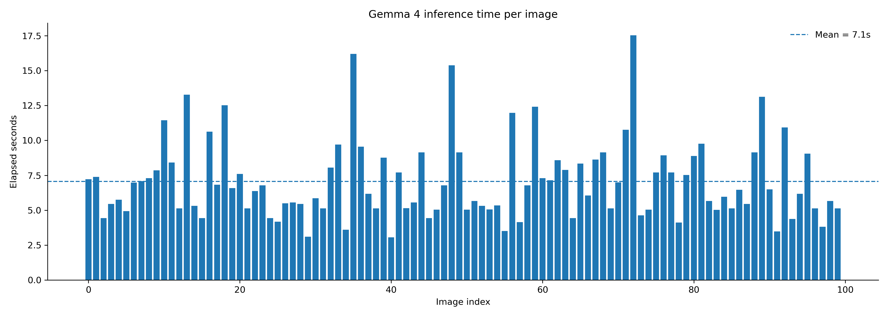
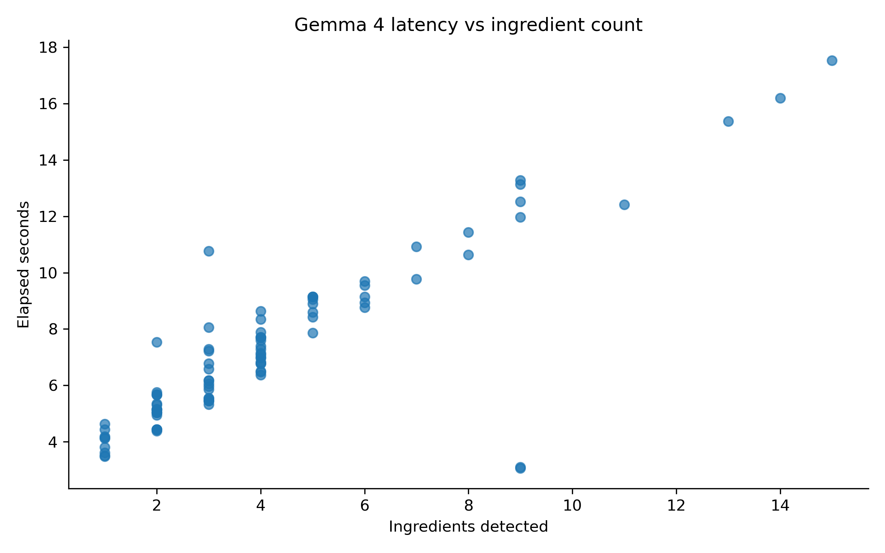

# Gemma 4 Latency Analysis

## Input File

- `data/annotations/gemma4_batch_100/gemma4_annotations_raw.csv`

## Summary Statistics

| Metric | Value |
|---|---:|
| Images analysed | 100 |
| Min inference time | 3.06s |
| Max inference time | 17.53s |
| Mean inference time | 7.06s |
| Median inference time | 6.42s |
| Stdev | 2.83s |
| Total inference time | 706s (11.8 min) |

## Slowest 5 Images

| Image | Elapsed | Ingredients detected |
|---|---:|---:|
| 0395_jpeg.rf.bbbf579e64f7eb81a5c82567ff6211e3.jpg | 17.53s | 15 |
| 0167_jpeg.rf.4ceb7858f4f41339361e24bea0a07dfa.jpg | 16.20s | 14 |
| 0245_jpeg.rf.46422fd23ffe6981544ac760e4f2b90f.jpg | 15.38s | 13 |
| 0063_jpeg.rf.5e3e62a677ed876855373c0f84a60118.jpg | 13.28s | 9 |
| 0515_jpeg.rf.947c47e165d2e1172410e5c63747e350.jpg | 13.13s | 9 |

## Fastest 5 Images

| Image | Elapsed | Ingredients detected |
|---|---:|---:|
| 01vtk6iubte51_jpg.rf.338a63065cc7d0942a1e87dbb8054459.jpg | 3.06s | 9 |
| 0131_jpeg.rf.44a0910142b1c384a062ae5e225eaf54.jpg | 3.10s | 9 |
| 0527_jpeg.rf.fdf5ffdee30d03e75acc173ff8d612d4.jpg | 3.48s | 1 |
| 0286_jpeg.rf.080f26cb5f6f38997549dbe8c5fff3ba.jpg | 3.51s | 1 |
| 0149_jpeg.rf.1525ada60b701afecc8be3278e9aaa91.jpg | 3.61s | 1 |

## Latency by Ingredient Count

| Ingredient count | Images | Avg latency |
|---|---:|---:|
| 0-3 | 54 | 5.38s |
| 4-6 | 32 | 7.95s |
| 7-9 | 10 | 9.98s |
| 10+ | 4 | 15.38s |

## Figures

## Notes

- Gemma 4 was queried with images resized to 512px on the longest side (see `src/vlm/run_gemma4_annotation_batch.py`).
- Compare against the Qwen baseline latency in `reports/latency_analysis/vlm_latency_summary.md` (50-image subset) for a cross-model latency reference, keeping in mind the two batches use different images and were run at different times under different server load.
