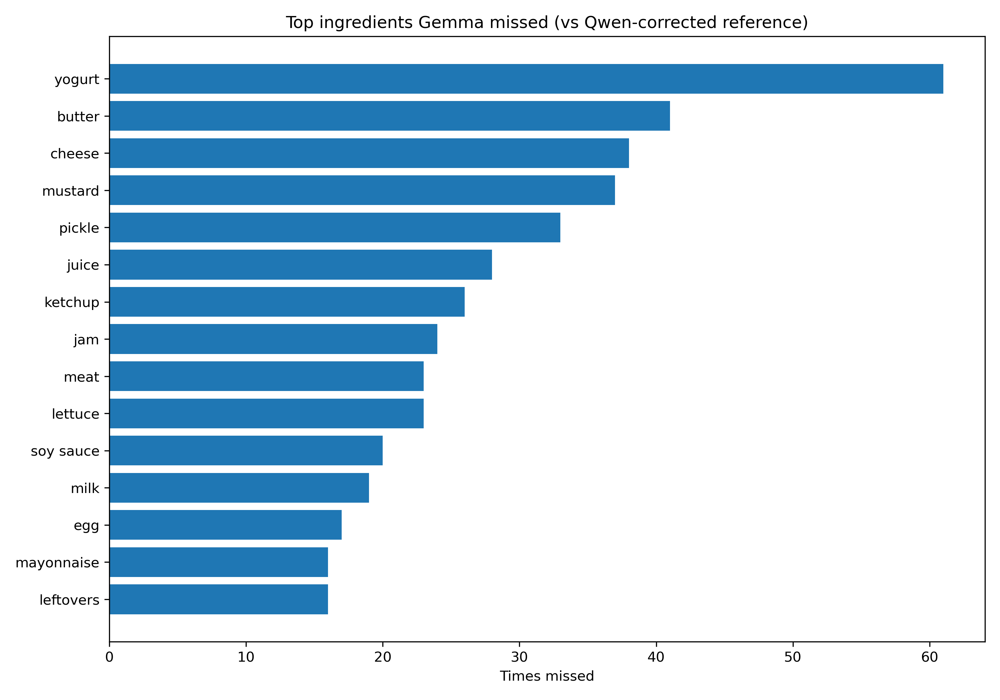

# Gemma 4 vs Qwen Ingredient Comparison

## Input File

- `data/annotations/gemma4_batch_100/gemma4_annotations_reviewed.csv`

Gemma's raw `visible_ingredients` predictions are evaluated against Qwen's
`corrected_visible_ingredients` review, used here as a ground-truth proxy
since this 100-image batch has no independent manual ground truth.

## Dataset

- Images compared: 100

## Micro-Averaged Metrics

| Metric | Value |
|---|---:|
| True Positives | 322 |
| False Positives | 72 |
| False Negatives | 940 |
| Precision | 0.8173 |
| Recall | 0.2552 |
| F1-score | 0.3889 |

## Macro-Averaged Metrics

| Metric | Value |
|---|---:|
| Precision | 0.8484 |
| Recall | 0.2575 |
| F1-score | 0.3730 |

## Accuracy-Like Metrics

| Metric | Value |
|---|---:|
| Exact Match Accuracy | 0.0000 |
| Mean Jaccard Similarity | 0.2478 |

## Average Ingredients Detected

| Source | Average per image |
|---|---:|
| Gemma (raw) | 3.94 |
| Qwen (corrected) | 12.62 |

Gemma detects 31% of the ingredient count Qwen confirms per image on average.

## Most Missed Ingredients

Top ingredients present in the Qwen-corrected reference but missed by Gemma:

| Ingredient | Times missed |
|---|---:|
| yogurt | 61 |
| butter | 41 |
| cheese | 38 |
| mustard | 37 |
| pickle | 33 |
| juice | 28 |
| ketchup | 26 |
| jam | 24 |
| meat | 23 |
| lettuce | 23 |

## Best / Worst Per-Image Agreement

Worst 5 (lowest F1):

| Image | F1 | Precision | Recall |
|---|---:|---:|---:|
| 0131_jpeg.rf.44a0910142b1c384a062ae5e225eaf54.jpg | 0.0000 | 0.0000 | 0.0000 |
| 01vtk6iubte51_jpg.rf.338a63065cc7d0942a1e87dbb8054459.jpg | 0.0000 | 0.0000 | 0.0000 |
| 0372_jpeg.rf.81d90a1ace5cc2289a72d66d65784b10.jpg | 0.0000 | 0.0000 | 0.0000 |
| 0487_jpeg.rf.02a065a1f108df186284da90d8d1aab9.jpg | 0.0952 | 0.5000 | 0.0526 |
| 0343_jpeg.rf.754ff21efa4100a8e8ce89a16382c682.jpg | 0.1176 | 0.2500 | 0.0769 |

Best 5 (highest F1):

| Image | F1 | Precision | Recall |
|---|---:|---:|---:|
| 0316_jpeg.rf.9bf9289ad8573728f0bde7c8d320da8f.jpg | 0.9565 | 1.0000 | 0.9167 |
| 0245_jpeg.rf.46422fd23ffe6981544ac760e4f2b90f.jpg | 0.8571 | 1.0000 | 0.7500 |
| 0395_jpeg.rf.bbbf579e64f7eb81a5c82567ff6211e3.jpg | 0.8125 | 0.9286 | 0.7222 |
| 0013_jpeg.rf.a147b6b2c2efbe662e233e5ec88af8c5.jpg | 0.7500 | 1.0000 | 0.6000 |
| 0079_jpeg.rf.8b34b144a1a504c0ef4aef30bf86865e.jpg | 0.7000 | 0.8750 | 0.5833 |

## Output Files

- Per-image results: `reports/gemma4_batch_100/gemma_vs_qwen_per_image.csv`
- Most missed ingredients: `reports/gemma4_batch_100/gemma_missed_ingredients.csv`
- Figure: `reports/gemma4_batch_100/figures/gemma_vs_qwen_top_missed.png`

## Notes

- Ingredient names are normalized using `configs/ingredient_normalization.json`, the same map used for the main Qwen-vs-manual-ground-truth evaluation.
- Generic/uncertain terms (e.g. `unknown bottle`, `prepared food`) are excluded from matching, consistent with `src/evaluation/evaluate_vlm_predictions.py`.
- This comparison measures agreement between Gemma and Qwen, not absolute correctness against a human-verified label set.
